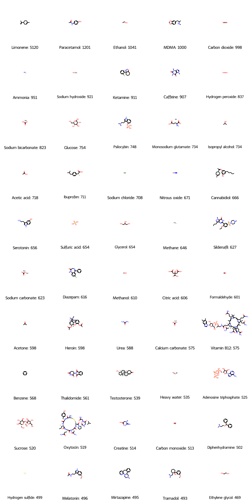

# Wikipedian-compounds
Parsing Wikipedia Chembox data for fun.

English Wipedia pages with the templates `['drugbox', 'chembox','Drugbox', 'Chembox']`,
and separately with `['Reactionbox', 'reactionbox']`.

## Parsing code
```python
import mwxml, bz2
from wiki_category_analyser import WikicatParser

dump = mwxml.Dump.from_file(bz2.open('dumps/enwiki-latest-pages-articles.xml.bz2', mode='rt', encoding='utf-8'))

print(dump.site_info.name, dump.site_info.dbname)

# ----------------

import re, functools

data = []


compound_pages = {}
for page in dump:
    revision = next(page)
    if revision.text is None:
        continue
    for k in ('drugbox', 'chembox','Drugbox', 'Chembox'):
        if k in revision.text:
            break
    else:
        continue
    compound_pages[page.title] = revision.text
    
# ----------------
    
import gzip, pickle

with gzip.open('compound_pages.pkl.gz', 'wb') as fh:
    pickle.dump(compound_pages, fh)
    
# ----------------

import gzip
import pandas as pd


wp = WikicatParser('', wanted_templates=Engli)

data = []
for title, page in compound_pages.items():
    data.append({'title': title, **wp.parse_templates(page)})
    
compounds = pd.DataFrame(data)

with gzip.open('compounds.pkl.gz', 'wb') as fh:
    compounds.to_pickle(fh)
  
# ----------------

# this works only on my setup sorry...
import json, gzip
for date_tag in ('202208', '202209',  '202210', '202211', '202212', '202301'):
    with gzip.open(f'extracted_dumps/pageviews-{date_tag}.json.gz', 'rb') as fh:
        counts = json.load(fh)
        compounds[f'counts_{date_tag}'] = compounds.title.apply(counts.get).fillna(0).astype(int)
        
# second half of 2022...
compounds[f'counts_2022H2'] = 0

for date_tag in ('202208', '202209',  '202210', '202211', '202212', '202301'):
    compounds[f'counts_2022H2'] += compounds[f'counts_{date_tag}']
    
compounds = compounds.sort_values('counts_2022H2', ascending=False)
```
SMILES are a bit of a mess...
```python
import re

smiles_pattern = re.compile(r"smiles\s*=\s*(.*?)[\{|\n]", re.IGNORECASE)
def combine_smilestrings(row: pd.Series) -> str:
    for k in ('smiles', 'SMILES', 'SMILES1', 'SMILES2', 'SMILES3', 'SMILES4', 'SMILES5'):
        if isinstance(row[k], str) and row[k].strip():
            return row[k].strip()
    rex = re.search(smiles_pattern, compound_pages[row['title']])
    if rex:
        return rex.group(1)
    return ''
              
compounds['combined_SMILES'] = compounds.apply(combine_smilestrings, axis=1)
```
Elements seem to have a weird infobox for H&S info and these are highly read, so marking elements is required.
```python
elements = ['Actinium', 'Aluminum', 'Americium', 'Antimony', 'Argon', 'Arsenic', 'Astatine', 'Barium', 'Berkelium', 'Beryllium', 'Bismuth', 'Bohrium', 'Boron', 'Bromine', 'Cadmium', 'Calcium', 'Californium', 'Carbon', 'Cerium', 'Cesium', 'Chlorine', 'Chromium', 'Cobalt', 'Copper', 'Curium', 'Darmstadtium', 'Dubnium', 'Dysprosium', 'Einsteinium', 'Erbium', 'Europium', 'Fermium', 'Fluorine', 'Francium', 'Gadolinium', 'Gallium', 'Germanium', 'Gold', 'Hafnium', 'Hassium', 'Helium', 'Holmium', 'Hydrogen', 'Indium', 'Iodine', 'Iridium', 'Iron', 'Krypton', 'Lanthanum', 'Lawrencium', 'Lead', 'Lithium', 'Livermorium', 'Lutetium', 'Magnesium', 'Manganese', 'Meitnerium', 'Mendelevium', 'Mercury', 'Molybdenum', 'Moscovium', 'Neodymium', 'Neon', 'Neptunium', 'Nickel', 'Nihonium', 'Niobium', 'Nitrogen', 'Nobelium', 'Oganesson', 'Osmium', 'Oxygen', 'Palladium', 'Phosphorus', 'Platinum', 'Plutonium', 'Polonium', 'Potassium', 'Praseodymium', 'Promethium', 'Protactinium', 'Radium', 'Radon', 'Rhenium', 'Rhodium', 'Roentgenium', 'Rubidium', 'Ruthenium', 'Rutherfordium', 'Samarium', 'Scandium', 'Seaborgium', 'Selenium', 'Silicon', 'Silver', 'Sodium', 'Strontium', 'Sulfur', 'Tantalum', 'Technetium', 'Tellurium', 'Tennessine', 'Terbium', 'Thallium', 'Thorium', 'Thulium', 'Tin', 'Titanium', 'Tungsten', 'Ununbium', 'Ununhexium', 'Ununoctium', 'Ununpentium', 'Ununquadium', 'Ununseptium', 'Ununtrium', 'Uranium', 'Vanadium', 'Xenon', 'Ytterbium', 'Yttrium', 'Zinc', 'Zirconium']

compounds['is_element'] = compounds['title'].isin(elements)
```
## Top 50
What are the top 50 most read-about compounds? Monthly views.
```python
from rdkit import Chem
from rdkit.Chem import Draw
from IPython.display import display, HTML

scomps = compounds.loc[compounds.combined_SMILES.astype(bool)]
maximum = 50
svg: str = Draw.MolsToGridImage(scomps.combined_SMILES[:maximum].apply(Chem.MolFromSmiles).to_list(),
                     legends=(scomps.title[:maximum] + ': '+(scomps.counts_2022H2/6)[:maximum].astype(int).astype(str)).to_list(),
                    molsPerRow=5,
                        useSVG=True)
with open('top.svg', 'w') as fh:
    fh.write(svg)
    
display(HTML(svg))
```


The limonene is a weird 2022 trend: [pageview analytics](https://pageviews.wmcloud.org/?project=en.wikipedia.org&platform=all-access&agent=user&redirects=0&start=2015-07&end=2023-01&pages=Paracetamol%7CLimonene%7CCaffeine%7CEthanol%7CMDMA)

Of the 20,638 compounds, [7,942 have had zero readers](unread.txt). Some may be parsing errors, like `Tröger's base` whose umlaut made the matching fail, but they seem mostly to obscure salts.